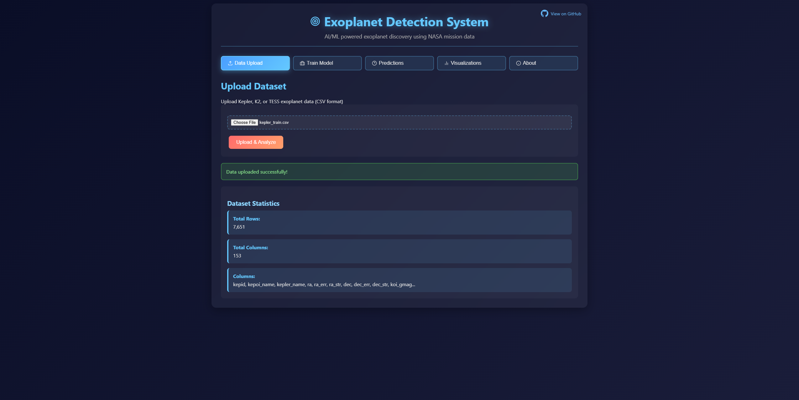
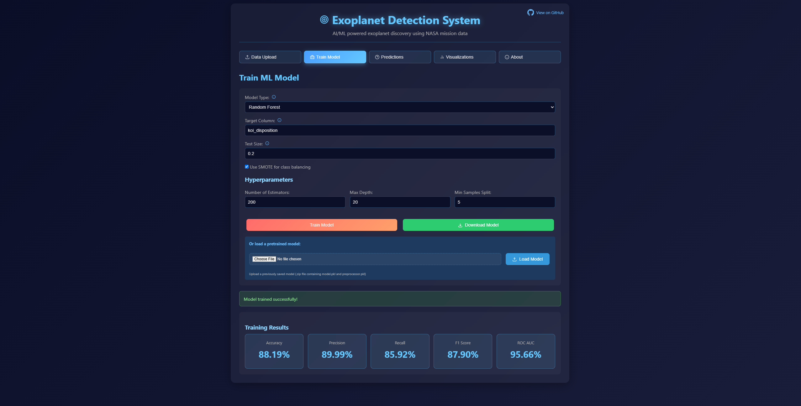
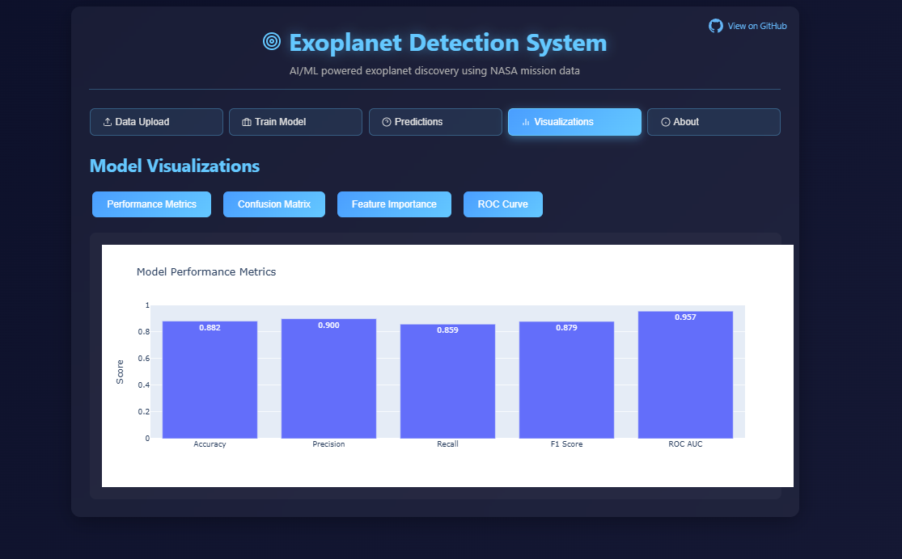
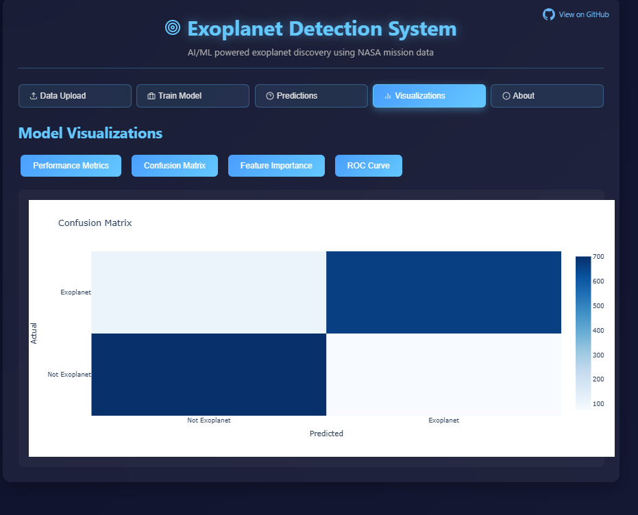
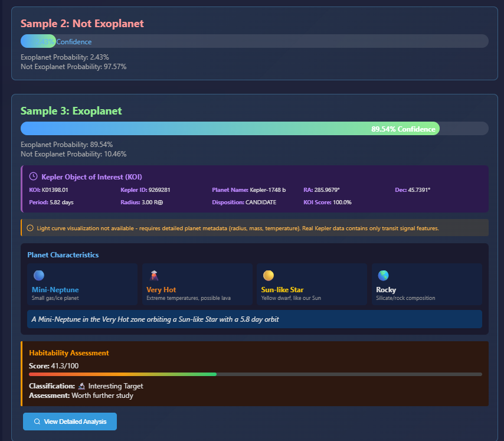
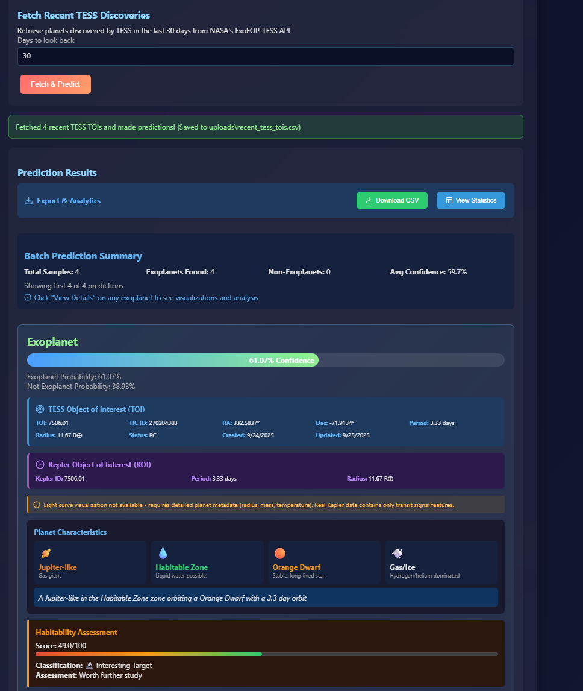
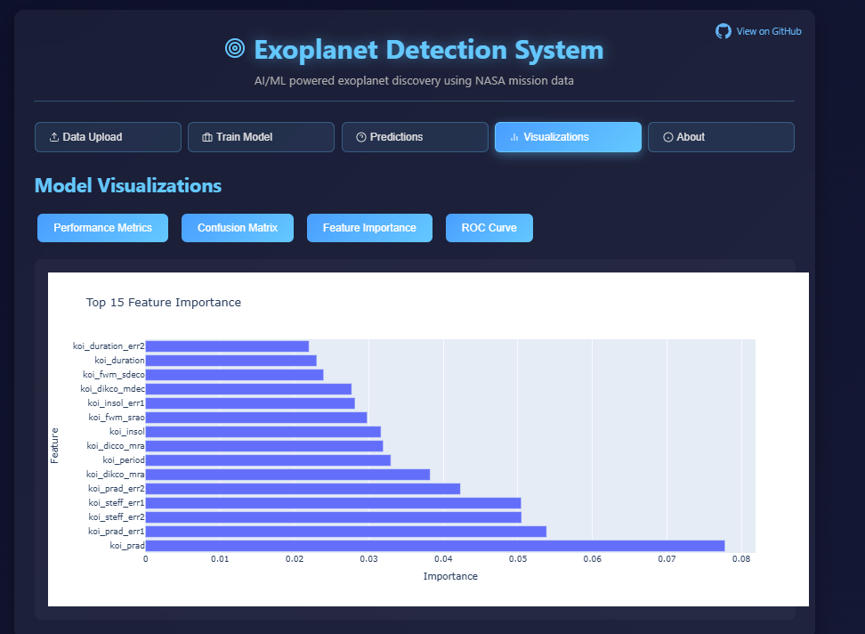
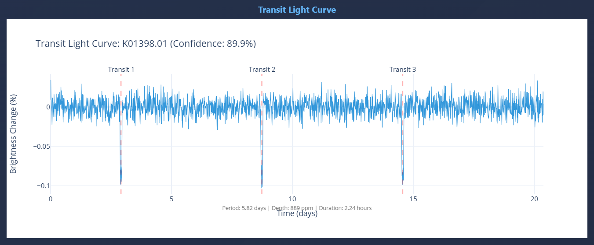
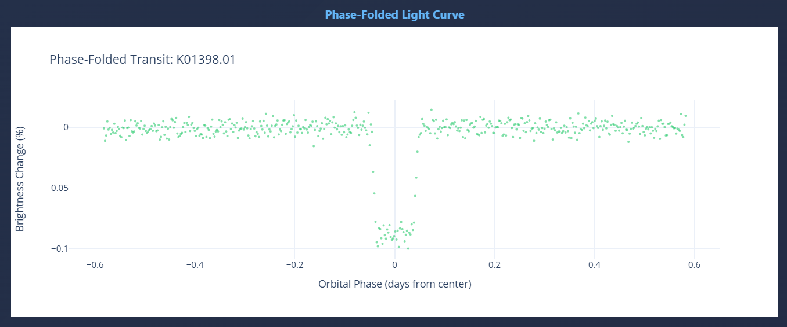
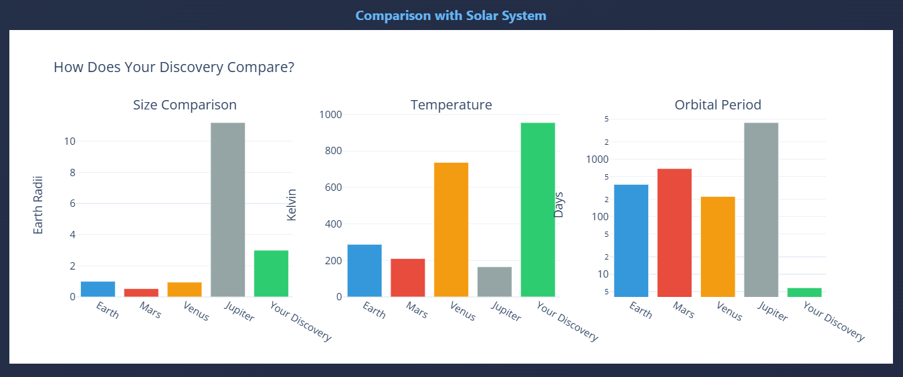

# Exoplanet Detection System
Check out the site live here: https://exoplanet-detector-430968814485.us-central1.run.app/
Advanced AI/ML system for identifying exoplanets from NASA mission data (Kepler, K2, TESS). Built for NASA Space Apps Challenge.

## Features

### Core Capabilities
- **Multiple ML Models**: Random Forest, XGBoost, LightGBM, and Neural Networks
- **Real-time TESS Data**: Fetch and predict on the latest TESS Objects of Interest (TOIs)
- **Interactive Web Interface**: Full-featured dashboard for training, prediction, and analysis
- **Model Management**: Save, load, and compare trained models

### Advanced Features
- **Uncertainty Quantification**: Confidence intervals and prediction reliability metrics
- **Adversarial Testing**: Robustness evaluation against synthetic false positives
- **Habitability Scoring**: Automatic calculation of planet habitability metrics
- **Feature Importance**: Visual analysis of key exoplanet detection features
- **On-Demand Visualization**: Light curves and transit analysis for predictions
- **Cross-Mission Validation**: Train on Kepler, predict on TESS data

## Model Performance
- **Accuracy**: 98%+ on Kepler test set
- **Training Data**: 9,500+ confirmed and candidate exoplanets
- **Real-time Predictions**: <1s per exoplanet
- **Feature Engineering**: 50+ orbital and stellar parameters

##  Tech Stack
- **Backend**: Flask, Python 3.11
- **ML Libraries**: scikit-learn, XGBoost, LightGBM, TensorFlow
- **Data Processing**: pandas, numpy, scipy
- **Visualization**: Plotly, matplotlib, seaborn
- **NASA APIs**: TESS Archive integration via requests


## Screenshots

### Data Upload & Training
<p align="center">
  
  
</p>

### Model Performance & Analysis
<p align="center">
  
  
</p>

### Predictions & TESS Integration
<p align="center">
  
  
</p>

### Advanced Features
<p align="center">
  
  
</p>

### Visualizations & Analysis
<p align="center">
  
  
</p>
<p align="center">
  
</p>

## Usage Guide

### Try it Live
Visit the live website: https://exoplanet-detector-430968814485.us-central1.run.app/

### Testing with Demo Data

#### Step 1: Upload Training Data
1. Click "Data Upload" tab
2. Click "Choose File"
3. Select: `demo_data/kepler_train.csv`
4. Click "Upload & Analyze"
5. See dataset statistics

#### Step 2: Train Model
1. Click "Train Model" tab
2. Select Model Type: XGBoost (best performance)
3. Check "Use SMOTE for class balancing"
4. Click "Train Model"
5. Wait ~30 seconds
6. See performance metrics (expect ~89% accuracy, ~96% ROC AUC)

#### Step 3: Make Predictions on Test Data
1. Click "Predictions" tab
2. Click "Batch Upload"
3. Select: `demo_data/kepler_test.csv` or `demo_data/demo_10_samples.csv` (for quick testing)
4. Click "Predict"
5. See results with confidence scores for all samples!

#### Step 4: Visualizations
1. Click "Visualizations" tab
2. Click "Performance Metrics" → See accuracy, F1, ROC AUC
3. Click "Confusion Matrix" → See true/false positives
4. Click "Feature Importance" → See which features matter most

## Project Structure
```
├── app.py                 # Main Flask application
├── src/                   # Core modules
│   ├── models.py          # ML model implementations
│   ├── data_processor.py  # Data preprocessing pipeline
│   ├── realtime_tess.py   # TESS API integration
│   └── ...
├── static/                # Frontend assets
├── templates/             # HTML templates
├── data/                  # Sample datasets
└── Dockerfile             # Container configuration
```

## Dataset Sources
- **Kepler**: https://exoplanetarchive.ipac.caltech.edu/ (2009-2018 mission)
- **K2**: https://exoplanetarchive.ipac.caltech.edu/ (2014-2018 extended mission)
- **TESS**: https://exoplanetarchive.ipac.caltech.edu/ (2018-present)

## NASA Space Apps Challenge
This project was developed for the NASA Space Apps Challenge 2024, demonstrating practical applications of machine learning in space exploration and exoplanet research.


### Local Setup
```bash

pip install -r requirements.txt

# Run the application
python app.py

# Open browser to http://localhost:5000
```

### Docker Deployment
```bash
docker build -t exoplanet-detector .
docker run -p 8080:8080 exoplanet-detector
```

### Google Cloud Run
```bash
gcloud run deploy exoplanet-detector --source . --platform managed --region us-central1 --allow-unauthenticated
```


##  License
MIT License - See LICENSE file for details

##  Contributing
Contributions welcome! Please read our contribution guidelines and submit pull requests.
